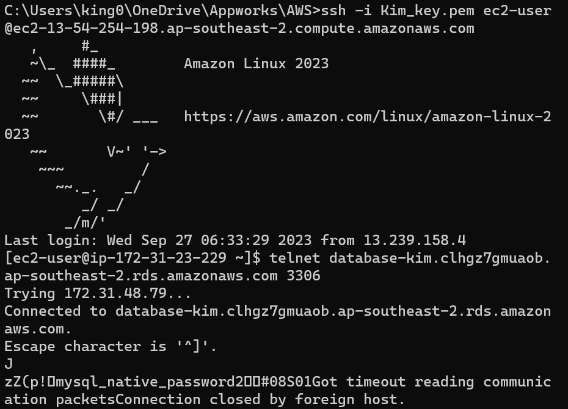

# remote-assignments
1. Description
    Understanding Check
    
    (1)I can't connect to my RDS, and only log in with my EC2 instance.(Mentor told me I can further discuss with her to find out bugs) But, basically, people can use dbeaver to link the RDS created by themselves, and they can write SQL command in the dbeaver platform to manipulate the data they want. 
    (2)Yes. Public IPs are just randomly distributed by the internet when instances need them. Once instances are closed, those public IPs would be assigned to other places. This change is relatively disadvantageous when people need a fixed IP to keep connection with some specific services.  
    (3)provide stable public IPv4 addresses for cloud resources. They ensure reliability, making it easier to manage DNS, security rules, and service availability when cloud resources change.
2. Environment requirements
    (1)Sync file has pretty long total duration(almost 32 seconds) and Async file's total duration is close to a single function call, and the later shows bigger variance of function call duration(three same functions) than async one(three different functions). 
    (2)When we have to deal with some tasks which are time-consuming. For example, if we want to build a shopping website, we had better use an async design that keeps the whole service responsive while computing complex tasks in the same time. 
    (3)Callback : 
        pros : simple to write, pretty friendly for beginners to write. 
        cons : Callback hell. Complex to read. Nested construction makes people crazy.
      Promise : 
        pros : more elegant formality and error handling.  
        cons : can only pass a single value, and this formality is hard to change.
      async/await : 
        pros : Readable. Simplify the idea of async. 
        cons : which is just based on promise. If await is used excessively in a single thread, it can lead to unintended blocking behavior. 
    (4)Not pretty sure why the sync file's first function call has dramatically high running time(longer than sum of running time in async file). I think the reason is that I use a third party model "sync-request", which designs many tricky changes to prevent the js from auto-executing following codes before the current one has not finished yet. 
3. How to use
   I write the two files. One is sync and another is async base. 
   
   Sync : 
   I use a third party model "sync-request" to get the response of the indicated url. This model makes my program wait for the whole getting process finished before executing the next line of code. I use S and E as a time record to calculate the total time of three times of function call. The total time, 32 seconds, is almost the sum of the three function call's running time(17 sec+7 sec+7 sec). This is reasonable cause sync is section by section, which wastes a lot of time in waiting.
   
   Async : 
   I use three ways to implement async design, callback, promise and  async/await. Callback method is pretty intuitive. I use console.log as my callback function. After getting the response, this callback would not be executed immediately, Instead, it would be scheduled into the function queue and wait for all sync events being completed. When its callback function turns, it starts to execute seconds parameters, (response)=>.... This callback function finally receives an "end" signal and records endTime in E, which collects three function call's endTime for calculating the whole timespan of the file.   
   Promise and sync method are exactly the same method. sync/await method revise the ".then()..." grammar into "await function name", while these two are both based on the promise constructor. The promise method separates callback into two parts :  getting response part and console.log part.After first getting response and calculating execution time, I use "then.()" to console.log the result and current(accumulated) total time. Async function uses the same function "requestPromise", and different from the second method, we use "await" to wait for the "requestPromise" end, then get the only result "executionTime" and print them out. The final total time is close to the single function call's running time, because these three function calls are almost executed simultaneously, so it is understandable to spend a shorter time finishing the whole process. 
   
