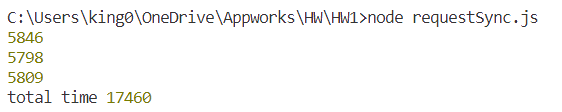
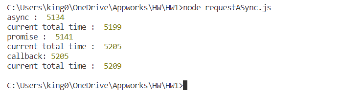

# remote-assignments
1. Description
       I write the two files. One is sync and another is async base. 
   Sync : 
   I use a third party model "sync-request" to get the response of the indicated url. This model makes my program wait for the whole getting process finished before executing the next line of code. I use S and E as a time record to calculate the total time of three times of function call. The total time, 32 seconds, is almost the sum of the three function call's running time(17 sec+7 sec+7 sec). This is reasonable cause sync is section by section, which wastes a lot of time in waiting.
   
   Async : 
   I use three ways to implement async design, callback, promise and  async/await. Callback method is pretty intuitive. I use console.log as my callback function. After getting the response, this callback would not be executed immediately, Instead, it would be scheduled into the function queue and wait for all sync events being completed. When its callback function turns, it starts to execute seconds parameters, (response)=>.... This callback function finally receives an "end" signal and records endTime in E, which collects three function call's endTime for calculating the whole timespan of the file.   
   Promise and sync method are exactly the same method. sync/await method revise the ".then()..." grammar into "await function name", while these two are both based on the promise constructor. The promise method separates callback into two parts :  getting response part and console.log part.After first getting response and calculating execution time, I use "then.()" to console.log the result and current(accumulated) total time. Async function uses the same function "requestPromise", and different from the second method, we use "await" to wait for the "requestPromise" end, then get the only result "executionTime" and print them out. The final total time is close to the single function call's running time, because these three function calls are almost executed simultaneously, so it is understandable to spend a shorter time finishing the whole process. 
       
2. Environment requirements
    Node.js
3. How to use
    just Directly run one of two files, and in terminal it would show the specific running time of three function call and total execution time. 

